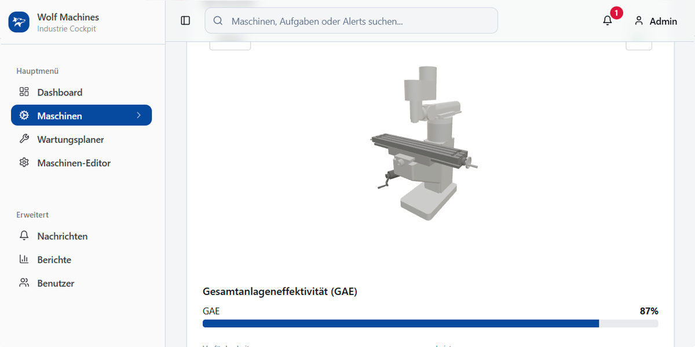

# Wolf Machines

Industrial Smart Maintenance Cockpit  
Machine monitoring, maintenance planning, and production optimization for Industry 4.0


Wolf Machines is an industrial cockpit for smart machine maintenance. It provides comprehensive insights into machine status, errors, power consumption, and production quality — all in real-time, directly in your browser.



## Features

- **Dashboard**: Overview of warnings, errors, machine status, power consumption, and analytics  
- **Machines**: 3D visualization with Three.js, status display, errors, temperature, quality, power consumption, and component replacement management  
- **Maintenance Planner**: Schedule and view upcoming maintenance tasks  
- **Machine Editor**: Node-based editing of machine components with detailed views  
- **Messages**: Alerts and notifications about machine status and errors  
- **Reports**: Downloadable reports  
- **User Management**: Manage users with names, IDs, roles, permissions, and email addresses  

## Getting Started

### Prerequisites

- Node.js (v14 or higher)  
- npm or yarn  

### Installation & Running

#### Local Setup

Clone the repository:

```bash
git clone https://github.com/your-username/wolf-machines.git
cd wolf-machines
```

Install dependencies:

```bash
npm install
```

Start the development server:

```bash
npm run dev
```

Open http://localhost:3000 in your browser.


### Production & Deployment

Build for production
```bash
npm run build
```

The build output will be generated in the dist folder, ready to deploy to any static web server.

### Deploy to GitHub Pages

The app is configured to run in the /wolf-machines/ subfolder.


## Contributing

Contributions are what make the open source community such an amazing place to learn, inspire, and create. Any contributions you make are greatly appreciated.

Fork the repository

Create a feature branch:

```bash
git checkout -b feature/YourFeature
```

Commit your changes:

```bash
git commit -m "Add your feature description"
```

Push the branch:

```bash
git push origin feature/YourFeature
```

Open a pull request on GitHub.


## Acknowledgements

React — for the powerful UI framework
Tailwind CSS — for flexible, fast styling
Vite — for blazing fast builds
Three.js — for advanced 3D visualizations


## License

This project is licensed under the MIT License - see the LICENSE file for details.

MIT © 2025 Wolf Machines
See [LICENSE](./LICENSE) for details.

